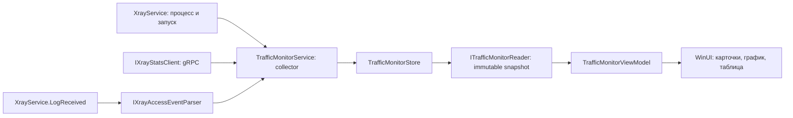

# Архитектура мониторинга Xray

## Текущий этап

Реализованы типизированные контракты, границы транспортного/парсерного/UI слоёв и потокобезопасный TrafficMonitorStore. Добавлена страница TrafficMonitorControl, график TrafficChartControl и TrafficMonitorViewModel, работающая через ITrafficMonitorReader. Сборщик пока не подключён к работающему Xray; конфигурация и сетевое поведение приложения не меняются. Новых NuGet-зависимостей на этом этапе нет.

## Поток данных

TrafficMonitorService, gRPC-клиент и реализация парсера — следующие этапы. Store, контракты и UI реализованы. В MainViewModel страница пока создаётся без reader: показывает явное состояние «сбор ещё не подключён» без демонстрационных данных.

## Ответственность компонентов

| Компонент | Контракт / ответственность |
| --- | --- |
| TrafficCoreSession | Уникальный Guid одного запуска процесса, локальный endpoint, UTC начала. Не путать с выбранным сервером. |
| TrafficCounterSnapshot | Типизированные счётчики, sessionId, время наблюдения UTC и монотонное Elapsed с запуска. |
| IXrayStatsClient | Один клиент на запуск; reset=false, cancellation, async disposal. Возвращает счётчики, не вычисляет скорость. |
| IXrayAccessEventParser | Преобразует access-строку в событие или возвращает null для остальных строк. Не выполняет DNS/поиск процессов. |
| TrafficMonitorStore | Сессии, базовые значения, скорости, наблюдённые объёмы, ограниченная история. Не знает о gRPC/WinUI/таймерах. |
| ITrafficMonitorReader | Неизменяемый снимок для UI и локальная очистка. Нет методов изменения маршрутов или управления ядром. |
| TrafficMonitorOptions | Явный набор учитываемых inbound/outbound и лимиты. Входные коллекции копируются и нормализуются. |

## Семантика данных

- Accepted — ядро приняло обращение; не свидетельство успешной доставки. Статус события и выбранный маршрут — разные поля: accepted может вести в block.
- Источник и назначение необязательны; адрес может быть замаскирован. ProcessName/ProcessId nullable. Заполнение предположением запрещено.
- Нет полей ActiveConnectionCount, ConnectionBytes или ClosedAt: существующие источники их не гарантируют.
- Upload/Download заданы относительно клиента. Общий объём — выбранные пользовательские inbound. Outbound служат отдельной разбивкой и никогда не складываются с общим объёмом или автоматически друг с другом.
- Объём сессии означает сумму наблюдённых положительных разниц после первого baseline, а не объём от начала жизни процесса. Пропуски не восполняются догадками. Подпись UI должна явно говорить о наблюдённом трафике; это также не биллинг провайдера.
- Скорость вычисляется по монотонному Elapsed, а ObservedAt нужен только для подписей. Перевод часов Windows не меняет скорость.
- Speed=null означает baseline, сброс счётчиков, остановку или отсутствие данных. Speed=0 означает подтверждённое отсутствие прироста за измеренный интервал.
- Неизвестные теги/пользовательские счётчики не попадают в baseline; память ограничена измеряемыми ключами. Не складывать API/test inbound с пользовательскими.

## Состояния и жизненный цикл

1. BeginSession: очистить историю/счётчики, установить WaitingForSample, сбросить монотонную границу.
2. Первый ответ: baseline без скорости и без приписывания старых байтов текущему окну наблюдения.
3. Следующий ответ: Live, разницы и скорость по фактической длительности интервала.
4. Ошибка API: Unavailable + Gap, объёмы сохраняются, скорость отсутствует. Первый успешный ответ после ошибки — новый baseline.
5. Явное уменьшение счётчика: CounterReset без добавления байтов; текущие значения становятся baseline для следующего интервала. Исчезновение ранее ненулевого счётчика — Unavailable/IncompleteCounters: разрыв продолжается, пока ключ не вернётся, затем устанавливается baseline. Несколько подряд неполных ответов не превращаются в нулевой baseline.
6. EndSession: Stopped, сохранить историю для просмотра, запретить дальнейшие записи этой сессии.
7. Новый запуск: новый Guid; поздние ответы, события и уведомления остановки старой сессии игнорируются.
8. Clear: только локальные история/объёмы/baseline, не запрос reset к ядру. Монотонная граница, известные ненулевые ключи и последовательность идентификаторов строк сохраняются. Unavailable и причина недоступности остаются до получения данных; очистка не означает восстановление API.

При смене набора измеряемых тегов collector создаёт новый store с TrafficMonitorOptions из нового конфига. Будущий фасад ITrafficMonitorReader должен оставаться стабильным для UI и атомарно переключать store. До подключения фасада Store можно использовать напрямую в тестах.

## Потоки, нагрузка и приватность

- Store защищён короткими lock; возвращает ImmutableArray снимки, UI никогда не получает изменяемую коллекцию сборщика.
- История: 5000 обращений и 900 точек по умолчанию; добавление в очередь O(1). AccessCount учитывает все принятые события с очистки, EvictedAccessCount — вытесненные из истории.
- Sequence не сбрасывается при Clear/новой сессии внутри store; одинаковый timestamp не создаёт конфликт ключей строк.
- Collector должен опрашивать последовательно раз в секунду, не создавать пересекающиеся запросы. Таймаут/отмена и backoff принадлежат collector/transport.
- Обработчик stdout должен только передавать данные в ограниченную очередь collector. Переполнение входной очереди требуется учитывать отдельно от вытеснения событий store; этот ingress ещё не реализован.
- UI обновляется раз в 250 мс на dispatcher. Pause замораживает снимок UI, а не сбор.
- История не пишется на диск автоматически; сырые строки не хранятся в контрактах. Маскированные адреса не раскрываются.
- Неподходящие timestamps/old session не меняют состояние; null-элементы и измеряемые отрицательные/дублированные счётчики дают InvalidCounters и разрыв графика.

## Следующий этап подключения

1. Реализовать XrayStatsClient со сгенерированными protobuf-моделями и постоянным gRPC-каналом. Проверить Native AOT/trim в release-прототипе прежде чем интегрировать UI.
2. Добавить в XrayConfigBuilder stats/policy/api.listen. XrayService публикует session ID и endpoint только для реально запущенного основного ядра; тестовые ядра не подключаются к монитору.
3. Реализовать XrayAccessEventParser с реальными вариантами IPv6, >>/->, accepted/rejected, маскированием и нестандартными тегами.
4. Реализовать collector/facade: очереди, таймер, TimeProvider/монотонные метки, cancellation, rebind после рестарта, отписка при закрытии. Ошибки наблюдения не должны останавливать прокси.
5. Подключить TrafficMonitorViewModel и полноширинную страницу с графиком, виртуализированной таблицей, фильтрами и состояниями нет данных/пауза/остановлено.

## Проверки текущего этапа

Тесты TrafficMonitorStoreTests покрывают baseline/монотонную скорость, направление трафика, исключение двойного учёта и лишних тегов, сброс/пропадание счётчиков, API gaps, старые сессии и ответы не по порядку, очистку, immutable snapshots, границы буферов, одновременные чтения/записи и остановку.

Нативный UI, gRPC и release AOT в этот этап не входят; Debug-сборка проверяет включение доменного слоя в приложение, net10.0 тесты — отсутствие зависимости от WinUI.

## Интерфейс

- Кнопка Traffic в основной панели открывает полноширинную страницу. Состояние навигации Main/Personalize/Traffic; назад возвращает к серверам. При уходе со страницы и переходе в mini view выгружается, таймер отписывается; модель и её фильтры сохраняются.
- Четыре карточки: download/upload, суммарный наблюдённый объём, число access-событий. Null-скорость отображается прочерком.
- Нативный PathGeometry-график двух направлений с окнами 5/15 минут и подсказкой при наведении. Разрывы в измерениях и интервалы опроса более 3 секунд не соединяются линией.
- Виртуализированный ListView: время, назначение (включая порт), протокол/источник, цветной маршрут. Поиск адреса/приложения, фильтры, сортировка по времени/адресу, диалог подробностей и копирование назначения.
- Pause замораживает снимок, фильтры работают по нему. Clear сохраняет pause и сбрасывает локальные данные через reader. Обновление списка — один CollectionChanged Reset на пачку; неизменные строки не пересоздаются.
- При ширине менее 760 карточки располагаются в два ряда. Минимальная высота страницы 650 DIP; исходные ограничения возвращаются при выходе. Размер mini не меняется.
- en-US и zh-CN ресурсы, доступные имена поиска/фильтра/диапазона. Проверка в этой сессии только по коду, тестам и компиляции XAML: пользователь запретил computer-use и запуск UI.
- Разбивка объёмов по маршрутам и топ назначений из исходного плана пока не выведены; они остаются последующим расширением страницы после подключения collector.
